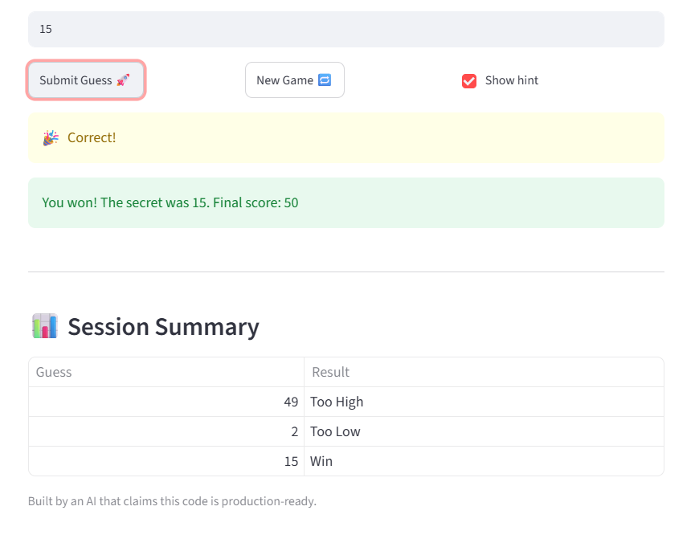

# 🎮 Game Glitch Investigator: The Impossible Guesser

## 🚨 The Situation

You asked an AI to build a simple "Number Guessing Game" using Streamlit.
It wrote the code, ran away, and now the game is unplayable. 

- You can't win.
- The hints lie to you.
- The secret number seems to have commitment issues.

## 🛠️ Setup

1. Install dependencies: `pip install -r requirements.txt`
2. Run the broken app: `python -m streamlit run app.py`

## 🕵️‍♂️ Your Mission

1. **Play the game.** Open the "Developer Debug Info" tab in the app to see the secret number. Try to win.
2. **Find the State Bug.** Why does the secret number change every time you click "Submit"? Ask ChatGPT: *"How do I keep a variable from resetting in Streamlit when I click a button?"*
3. **Fix the Logic.** The hints ("Higher/Lower") are wrong. Fix them.
4. **Refactor & Test.** - Move the logic into `logic_utils.py`.
   - Run `pytest` in your terminal.
   - Keep fixing until all tests pass!

## 📝 Document Your Experience

- [x] **Game's purpose:** A number-guessing game built with Streamlit where the player guesses a secret number using "higher/lower" hints.
- [x] **Bugs found:** (1) hints were backwards, (2) "New Game" didn't reset the game, (3) the score went negative after one wrong guess.
- [x] **Fixes applied:** Swapped the hint messages and removed the str() conversion so comparisons work; made "New Game" reset status, score, and history; refactored the logic into logic_utils.py.

## 📸 Demo Walkthrough

Describe your fixed game in numbered steps so a reader can follow along without watching a video:

1. User selects "Normal" difficulty (secret is between 1 and 100).
2. User enters a guess of 40 → the game shows "📈 Go HIGHER!".
3. User enters a guess of 70 → the game shows "📉 Go LOWER!".
4. User enters the correct number → the game shows "🎉 Correct!", balloons appear, and the final score is displayed.
5. User clicks "New Game" → the score, history, and attempts reset, and a new secret is chosen.

**Screenshot** *(optional)*: <!-- Insert a screenshot of your fixed, winning game here -->

## 🧪 Test Results

```
$ python -m pytest -v
collected 4 items

test/test_game_logic.py::test_winning_guess PASSED                       [ 25%]
test/test_game_logic.py::test_guess_too_high PASSED                      [ 50%]
test/test_game_logic.py::test_guess_too_low PASSED                       [ 75%]
test/test_game_logic.py::test_high_low_direction_not_swapped PASSED      [100%]

============================== 4 passed in 0.02s ==============================

```

## 🚀 Stretch Features

- [x] **Challenge 4 — Enhanced Game UI:** I added two UI features without changing the core game logic:
  - **Hot/Cold proximity indicator:** after each guess, the app shows 🔥 Hot! / 🌤️ Warm / ❄️ Cold (or 🎯 Bullseye) based on how close the guess is to the secret. This is powered by a new function `get_proximity_hint(guess, secret)` in `logic_utils.py`, which returns a label from the distance `abs(guess - secret)`. It is displayed in `app.py` with `st.caption("Proximity: ...")` inside the `if submit:` block.
  - **Session Summary table:** at the bottom of the page, `app.py` renders a `st.table` of every guess this game (Guess + Result), built from a new `st.session_state.rounds` list. Each round is recorded in the `if submit:` block and the list is cleared in the New Game block so the table resets.



